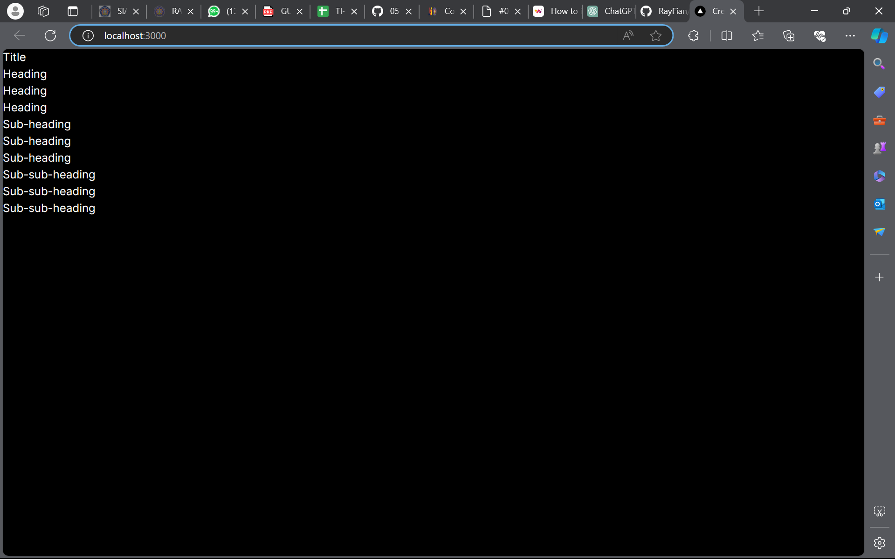
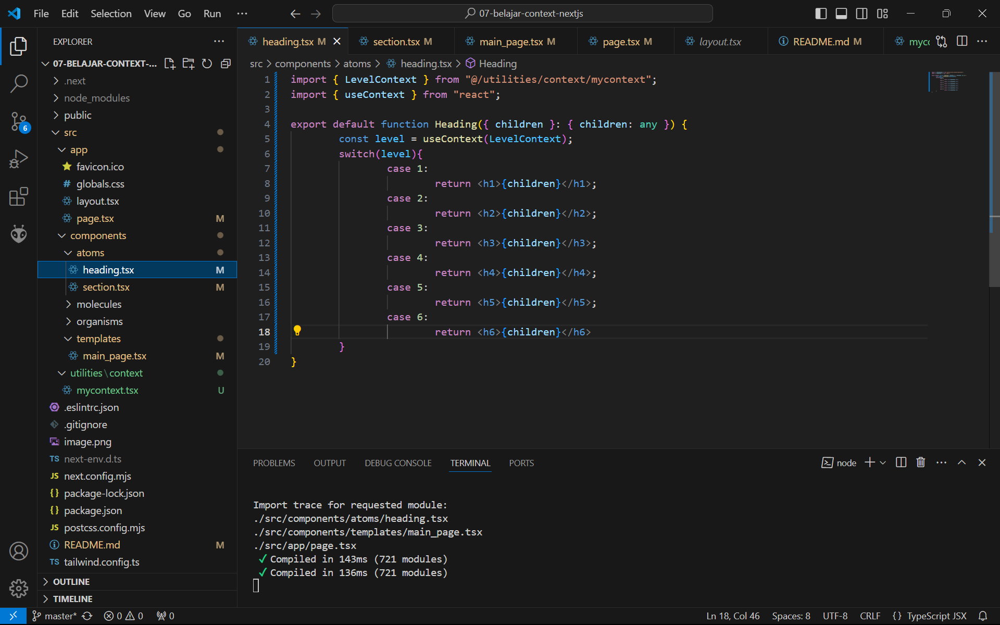
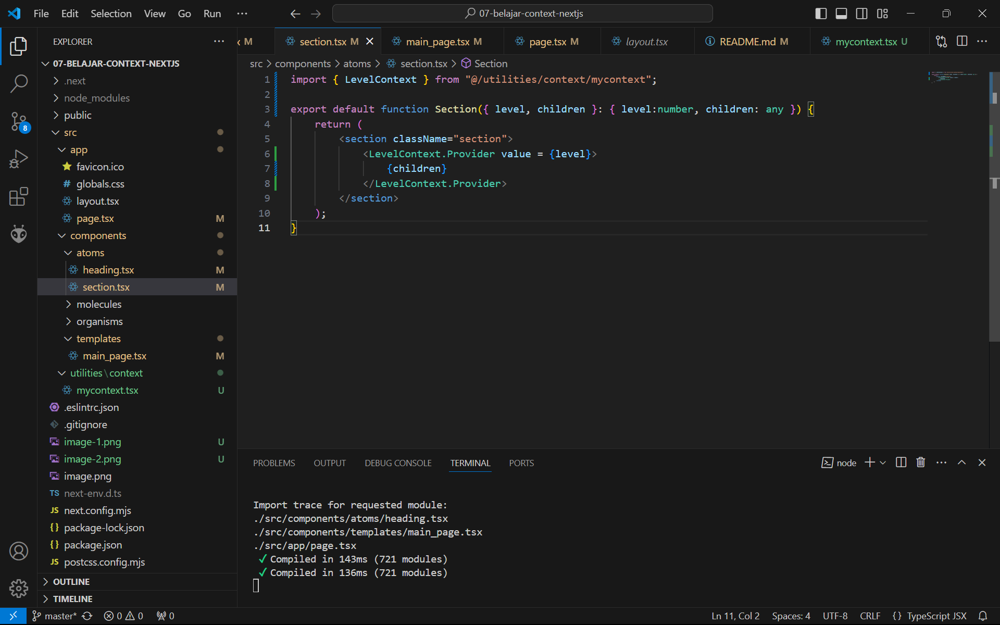
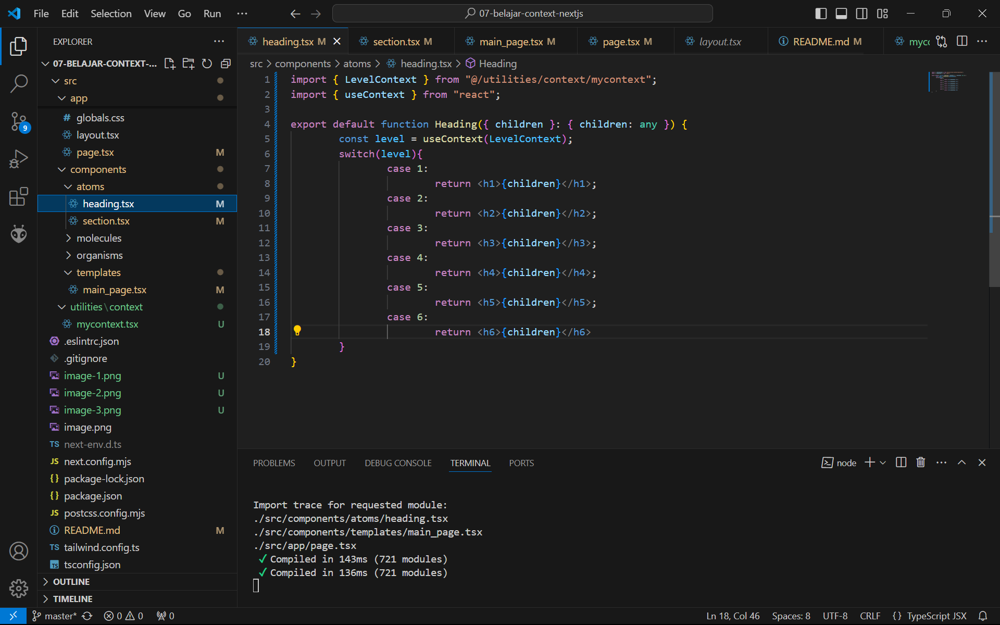
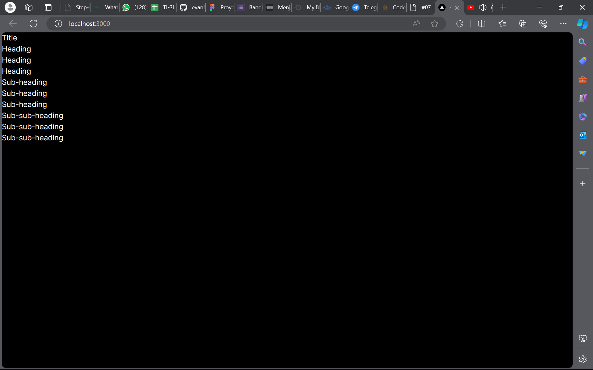
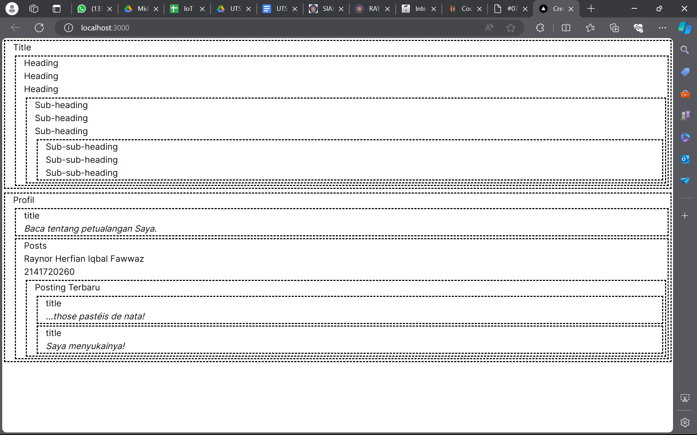
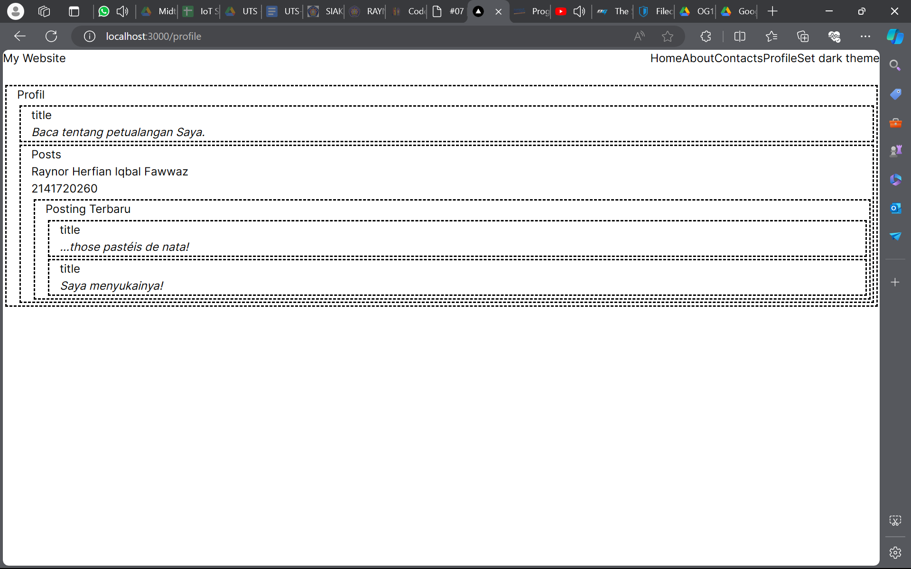

This is a [Next.js](https://nextjs.org/) project bootstrapped with [`create-next-app`](https://github.com/vercel/next.js/tree/canary/packages/create-next-app).

## Getting Started

First, run the development server:

```bash
npm run dev
# or
yarn dev
# or
pnpm dev
# or
bun dev
```

Open [http://localhost:3000](http://localhost:3000) with your browser to see the result.

You can start editing the page by modifying `app/page.tsx`. The page auto-updates as you edit the file.

This project uses [`next/font`](https://nextjs.org/docs/basic-features/font-optimization) to automatically optimize and load Inter, a custom Google Font.

## Learn More

To learn more about Next.js, take a look at the following resources:

- [Next.js Documentation](https://nextjs.org/docs) - learn about Next.js features and API.
- [Learn Next.js](https://nextjs.org/learn) - an interactive Next.js tutorial.

You can check out [the Next.js GitHub repository](https://github.com/vercel/next.js/) - your feedback and contributions are welcome!

## Deploy on Vercel

The easiest way to deploy your Next.js app is to use the [Vercel Platform](https://vercel.com/new?utm_medium=default-template&filter=next.js&utm_source=create-next-app&utm_campaign=create-next-app-readme) from the creators of Next.js.

Check out our [Next.js deployment documentation](https://nextjs.org/docs/deployment) for more details.

|  | Pemrograman Berbasis Framework 2024 |
|--|--|
| NIM |  2141720260|
| Nama |  Raynor Herfian Iqbal Fawwaz |
| Kelas | TI - 3I |


## Praktikum 1


We could create sections and also parts using specified components and combine it into 1 big part into template by editing the smaller component parts

### Soal 2








Before the result appear like the pictures above error appear said that we need to import components from mycontext.tsx. The error could be fixed by typing "use client"; at page.tsx file.

## Praktikum 2


### Soal 4


## Praktikum 3


The navigation button work well and navigate through the pages without any problem.